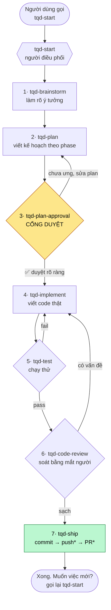
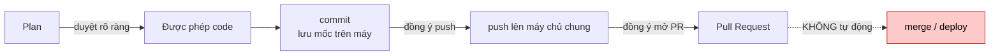

# tqd-coding-workflow

> Quy trình coding **7 bước tiếng Việt** cho người mới (level 0): từ ý tưởng → sản phẩm có Pull Request, đi qua từng bước có người dẫn.

[](https://github.com/abm-dungtq/tqd-coding-workflow/releases)
[](#giấy-phép)
[](#cài-đặt)

Đây là một **gói skill độc lập** cho các trợ lý AI coding. Nó biến một câu mơ hồ kiểu *"tôi muốn làm một trang web ghi chú"* thành một quy trình rõ ràng, chia làm 7 bước, **dừng lại chờ bạn duyệt trước khi viết code**, và kết thúc bằng một Pull Request để người khác xem.

Gói không phụ thuộc bất kỳ bộ skill nào khác. Mọi skill dùng tiền tố `tqd-`, không dùng namespace `ak:`.

---

## Mục lục

- [Dành cho ai?](#dành-cho-ai)
- [Cài đặt](#cài-đặt)
- [Bắt đầu dùng](#bắt-đầu-dùng)
- [Quy trình 7 bước](#quy-trình-7-bước)
- [Cách hoạt động (phân tích chi tiết)](#cách-hoạt-động-phân-tích-chi-tiết)
- [Chi tiết từng skill](#chi-tiết-từng-skill)
- [Cấu trúc gói](#cấu-trúc-gói)
- [Tải về & kiểm tra](#tải-về--kiểm-tra)
- [Câu hỏi thường gặp](#câu-hỏi-thường-gặp)
- [Giấy phép](#giấy-phép)

---

## Dành cho ai?

- **Người chưa biết code (level 0)** muốn làm một tính năng / sửa một lỗi nhưng không biết bắt đầu từ đâu.
- Người muốn trợ lý AI làm việc **có trình tự, có điểm dừng để duyệt**, thay vì tự ý code một mạch rồi đẩy lên.
- Mọi giải thích đều bằng **tiếng Việt, ngắn gọn**; gặp từ kỹ thuật (commit, push, PR, test…) sẽ được giải thích bằng một câu đơn giản.

Bạn **không cần tự gõ code** hay tự chạy lệnh. Trợ lý làm; bạn chỉ cần trả lời và duyệt.

---

## Cài đặt

Gói có thể dùng theo hai cách: **tải mã nguồn** (thư mục repo chính là "plugin") hoặc **tải file nén** từ mục Releases.

### Cách A — dùng trực tiếp mã nguồn

```sh
git clone https://github.com/abm-dungtq/tqd-coding-workflow.git
```

Thư mục vừa tải **chính là gói plugin** (chứa `plugin.json` và thư mục `skills/`).

| Host | Cách nạp gói |
|---|---|
| **OMP** | Trỏ `--plugin-dir` tới thư mục vừa clone, bật skill với `--skills='tqd-*'` |
| **Claude Code** | Đặt/symlink thư mục vào chỗ plugin của bạn (thư mục có `.claude-plugin/plugin.json`), hoặc thêm qua marketplace |
| **Codex** | Cài như một plugin skill (thư mục có `plugin.json`) |

### Cách B — tải file nén từ Releases

Vào [Releases](https://github.com/abm-dungtq/tqd-coding-workflow/releases), tải `tqd-coding-workflow-vi.zip`, giải nén, rồi dùng thư mục giải nén làm plugin như trên.

Kiểm tra toàn vẹn file (khuyến nghị):

```sh
shasum -a 256 -c tqd-coding-workflow-vi.zip.sha256
```

> Xem thêm hướng dẫn thân thiện cho người mới trong [`BAT-DAU.md`](./BAT-DAU.md).

---

## Bắt đầu dùng

Chỉ cần gọi **một** skill duy nhất — người điều phối:

```
tqd-start
```

- **OMP:** đọc tài nguyên `skill://tqd-start`
- **Claude Code:** gọi công cụ Skill `tqd-coding-workflow:tqd-start`
- **Codex:** chọn `$tqd-coding-workflow:tqd-start` trong catalog

Sau đó cứ trả lời từng câu hỏi. `tqd-start` sẽ tự dẫn bạn qua cả 7 bước, mỗi lượt chỉ yêu cầu bạn làm **một** việc, và luôn cho bạn biết *đang ở bước mấy / 7, vừa xong gì, sắp làm gì*.

Bạn **không** cần nhớ tên 7 skill con — chúng do `tqd-start` tự kích hoạt đúng lúc.

---

## Quy trình 7 bước

| # | Skill | Làm gì | Điểm mấu chốt |
|---|---|---|---|
| 1 | `tqd-brainstorm` | Làm rõ ý tưởng | Chốt **làm cái gì**, so sánh 2–3 hướng |
| 2 | `tqd-plan` | Viết kế hoạch theo *phase* | Chia nhỏ việc, ngôn ngữ người chưa biết code đọc được |
| 3 | `tqd-plan-approval` | **Cổng duyệt** | ⛔ **Dừng lại** — chưa duyệt = chưa được code |
| 4 | `tqd-implement` | Viết code thật | Bám plan đã duyệt, từng phase, không code giả |
| 5 | `tqd-test` | Chạy thử / kiểm tra | Fail → quay lại bước 4; pass → sang bước 6 |
| 6 | `tqd-code-review` | Soát lại bằng mắt người | Bắt lỗi & *regression*; có vấn đề → quay bước 4 |
| 7 | `tqd-ship` | Đóng gói, commit, PR | Xin đồng ý **riêng** cho push và **riêng** cho PR |



<sub>`*` push và mở PR là **hai lần xin đồng ý riêng biệt**. Trợ lý không bao giờ tự `merge` hay `deploy`.</sub>

---

## Cách hoạt động (phân tích chi tiết)

Phần này dành cho người muốn hiểu *tại sao* gói được thiết kế như vậy.

### 1. Kiến trúc: một người điều phối + bảy bước

Gói gồm **8 skill**: một *coordinator* (`tqd-start`) và bảy *stage* (mỗi bước một skill).

- **`tqd-start` sở hữu việc chuyển bước.** Nó là skill duy nhất người dùng cần gọi. Nó dẫn dắt hội thoại và kích hoạt bước kế tiếp.
- **Mỗi stage chỉ báo cáo kết quả về, *không tự nhảy* sang bước sau.** Đây là điểm thiết kế quan trọng: nếu mỗi stage tự kích hoạt bước kế, sẽ có *hai* nơi cùng quyết định luồng chạy → mâu thuẫn. Vì thế mô hình là **một chủ sở hữu luồng duy nhất**.

Kết quả: người dùng luôn có một mạch hội thoại nhất quán, biết mình đang ở đâu trong 7 bước.

### 2. Cơ chế kích hoạt skill anh em (theo từng host)

Gói chạy trên nhiều host khác nhau. Việc gọi skill con dùng **cơ chế skill-native của host đang chạy**, chứ **không** đọc file `SKILL.md` bằng đường dẫn tương đối, và **không** in một câu lệnh ra bắt người dùng tự gõ:

| Host | Cách kích hoạt skill anh em |
|---|---|
| **OMP** | Đọc tài nguyên `skill://tqd-brainstorm` |
| **Claude Code** | Gọi công cụ Skill với `tqd-coding-workflow:tqd-brainstorm` |
| **Codex** | Chọn `$tqd-coding-workflow:tqd-brainstorm` trong catalog skill |

Nếu host báo **không tìm thấy** skill anh em → trợ lý **dừng lại và báo rõ** cho người dùng (lỗi cài đặt gói), không tự bịa ra kết quả. Nhờ đó gói chạy y hệt nhau trên cả ba host.

### 3. Mô hình đồng ý (authorization) — phần cốt lõi

Gói được thiết kế để **AI không tự vượt rào**:

- **Duyệt plan là bắt buộc (bước 3).** Chưa có **lời đồng ý rõ ràng** về đúng bản plan vừa trình = **chưa được code**. Im lặng không tính là duyệt. Nếu plan bị sửa sau khi duyệt → phải **trình duyệt lại**.
- **Push và PR là hai lần đồng ý *riêng biệt* (bước 7).** Đồng ý push không đồng nghĩa đồng ý mở PR.
- **Không bao giờ tự `merge` hay `deploy`.** Gộp vào nhánh chính / đưa lên production nằm ngoài quyền của gói.



### 4. Ranh giới an toàn ở mỗi bước

- **Không code giả:** cấm placeholder, hàm rỗng, hay `TODO: implement` — code phải chạy thật.
- **Không mở rộng phạm vi:** không "tiện tay" thêm tính năng ngoài plan đã duyệt.
- **Test phải chạy thật:** cấm "test giả" chỉ để cho có; fail thì quay lại sửa, không bỏ qua.
- **Không lộ secret:** nếu phát hiện mật khẩu / token / khóa API / file `.env` → dừng, báo người dùng, không đưa vào commit.

### 5. Hai vòng lặp sửa lỗi

Luồng không phải một đường thẳng — có hai vòng quay lại `tqd-implement`:

- **Test fail (5 → 4):** tái hiện lỗi, sửa ở gốc, chạy lại tới khi pass.
- **Review có vấn đề (6 → 4):** phát hiện lỗi / regression khi soát bằng mắt → quay lại sửa, rồi test lại.

Chỉ khi **test pass** *và* **review sạch** mới được sang `tqd-ship`.

---

## Chi tiết từng skill

<details>
<summary><b>tqd-start</b> — người điều phối (điểm bắt đầu)</summary>

Điểm vào duy nhất. Dẫn dắt qua 7 bước, mỗi lượt yêu cầu người dùng **một** việc, giải thích từ kỹ thuật bằng một câu, luôn báo *đang ở bước mấy / vừa xong gì / sắp làm gì*. Tạm dừng ở bước 3 chờ duyệt. **Không** tự làm thay việc của từng bước, **không** tự code khi chưa chốt duyệt plan.
</details>

<details>
<summary><b>tqd-brainstorm</b> — Bước 1/7: làm rõ ý tưởng</summary>

Chốt **làm cái gì**: kết quả cuối người dùng muốn thấy, ràng buộc, so sánh 2–3 hướng, chọn hướng đơn giản nhất. Gom đủ 4 ý cho plan: *kết quả mong muốn · ràng buộc · không làm gì · bằng chứng hoàn thành*. **Ranh giới:** chưa viết plan, chưa code, không quyết định chi tiết kỹ thuật sâu (để `tqd-plan`).
</details>

<details>
<summary><b>tqd-plan</b> — Bước 2/7: viết kế hoạch theo phase</summary>

Biến hướng đã chốt thành kế hoạch chia **phase** nhỏ, mỗi phase có mục tiêu và bằng chứng "xong", viết bằng ngôn ngữ người chưa biết code đọc được. **Ranh giới:** chưa code, không thêm tính năng ngoài phạm vi, không hỏi "duyệt chưa" (việc của bước 3).
</details>

<details>
<summary><b>tqd-plan-approval</b> — Bước 3/7: cổng duyệt ⛔</summary>

**Cổng chặn** trước khi code. Trình plan dễ hiểu, **DỪNG LẠI** cho người dùng đọc và duyệt hoặc sửa. **Ranh giới:** tuyệt đối không code khi chưa có đồng ý rõ ràng; im lặng ≠ duyệt; plan đổi sau duyệt = trình duyệt lại.
</details>

<details>
<summary><b>tqd-implement</b> — Bước 4/7: viết code thật</summary>

Viết code theo plan đã duyệt, **từng phase một**, đúng thứ tự, sửa ở gốc vấn đề. **Ranh giới:** không code giả / TODO, không làm ngoài plan, không `merge`/`deploy`, không tự tạo PR (thuộc bước 7), không đợi người dùng tự gõ lệnh.
</details>

<details>
<summary><b>tqd-test</b> — Bước 5/7: chạy thử / kiểm tra</summary>

Chạy thử thật (smoke test / test) để có **bằng chứng phần vừa làm chạy đúng**. Có lỗi → tái hiện, sửa, chắc lỗi không còn. **Ranh giới:** không báo "xong" khi chưa chạy, không viết test giả, không sang bước 6 khi còn fail.
</details>

<details>
<summary><b>tqd-code-review</b> — Bước 6/7: soát bằng mắt người</summary>

Nhìn lại phần vừa đổi: đúng ý đã duyệt chưa, sạch chưa, có gây **regression** không, có lộ *secret* không. **Ranh giới:** không tự sửa code (thuộc bước 4), không đổi phạm vi, không ship/push/PR (thuộc bước 7).
</details>

<details>
<summary><b>tqd-ship</b> — Bước 7/7: đóng gói & Pull Request</summary>

Tóm tắt thay đổi, **commit** với lời nhắn rõ, rồi xin đồng ý **riêng cho push** và **riêng cho mở PR**. **Ranh giới:** không tự `merge`, không tự `deploy`, không commit secret, không bịa link PR, không báo "đã gửi" khi push chưa thành công.
</details>

---

## Cấu trúc gói

```
tqd-coding-workflow/
├── plugin.json                       # manifest chung (Agent Plugins)
├── .claude-plugin/plugin.json        # manifest cho Claude Code
├── BAT-DAU.md                        # hướng dẫn nhanh cho người mới
└── skills/
    ├── tqd-start/
    │   ├── SKILL.md                  # người điều phối
    │   └── references/
    │       └── runtime-activation.md # cơ chế kích hoạt theo host
    ├── tqd-brainstorm/SKILL.md
    ├── tqd-plan/SKILL.md
    ├── tqd-plan-approval/SKILL.md
    ├── tqd-implement/SKILL.md
    ├── tqd-test/SKILL.md
    ├── tqd-code-review/SKILL.md
    └── tqd-ship/SKILL.md
```

- **Thư mục gốc repo = gói plugin** → dùng trực tiếp làm `--plugin-dir`.
- Skill tự nhận diện qua thư mục `skills/` (không cần liệt kê thủ công trong manifest).

---

## Tải về & kiểm tra

- **Bản nén:** [Releases](https://github.com/abm-dungtq/tqd-coding-workflow/releases) → `tqd-coding-workflow-vi.zip`
- **Kiểm tra sha256:**

  ```sh
  shasum -a 256 -c tqd-coding-workflow-vi.zip.sha256
  ```

Gói đã được kiểm chứng: `claude plugin validate --strict` → `success:true`, và chạy thử hành vi trên OMP (`tqd-start` kích hoạt `tqd-brainstorm` và trả về câu hỏi *Bước 1/7 – Làm rõ ý tưởng*, không viết code).

---

## Câu hỏi thường gặp

**Tôi có cần biết code không?** Không. Trợ lý làm; bạn chỉ trả lời và duyệt.

**Nó có tự đẩy code lên GitHub / lên server không?** Không tự động. Push và mở PR đều phải có đồng ý riêng của bạn; gói **không bao giờ** tự `merge` hay `deploy`.

**Tôi phải nhớ 7 tên skill?** Không. Chỉ cần gọi `tqd-start`, nó tự dẫn.

**Chạy được trên trợ lý nào?** OMP, Claude Code, và Codex — cùng một gói, cùng hành vi.

**Muốn làm việc mới sau khi xong?** Gọi lại `tqd-start`.

---

## Giấy phép

[MIT](https://opensource.org/licenses/MIT).
